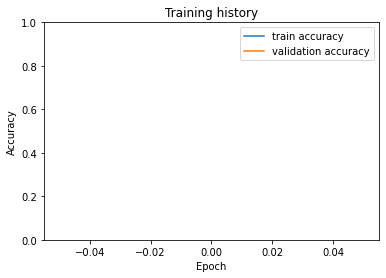

<a href="https://colab.research.google.com/github/Ankur3107/colab_notebooks/blob/master/Bert_Classification_Pt.ipynb" target="_parent"></a>


```
!wget https://raw.githubusercontent.com/SrinidhiRaghavan/AI-Sentiment-Analysis-on-IMDB-Dataset/master/imdb_tr.csv
```

    --2020-08-25 15:35:11--  https://raw.githubusercontent.com/SrinidhiRaghavan/AI-Sentiment-Analysis-on-IMDB-Dataset/master/imdb_tr.csv
    Resolving raw.githubusercontent.com (raw.githubusercontent.com)... 151.101.0.133, 151.101.64.133, 151.101.128.133, ...
    Connecting to raw.githubusercontent.com (raw.githubusercontent.com)|151.101.0.133|:443... connected.
    HTTP request sent, awaiting response... 200 OK
    Length: 23677025 (23M) [text/plain]
    Saving to: ‘imdb_tr.csv’
    
    imdb_tr.csv         100%[===================>]  22.58M  40.2MB/s    in 0.6s    
    
    2020-08-25 15:35:12 (40.2 MB/s) - ‘imdb_tr.csv’ saved [23677025/23677025]
    


```
!pip install transformers
```

    Collecting transformers
    [?25l  Downloading https://files.pythonhosted.org/packages/27/3c/91ed8f5c4e7ef3227b4119200fc0ed4b4fd965b1f0172021c25701087825/transformers-3.0.2-py3-none-any.whl (769kB)
         |████████████████████████████████| 778kB 3.5MB/s 
    [?25hRequirement already satisfied: dataclasses; python_version < "3.7" in /usr/local/lib/python3.6/dist-packages (from transformers) (0.7)
    Requirement already satisfied: filelock in /usr/local/lib/python3.6/dist-packages (from transformers) (3.0.12)
    Requirement already satisfied: regex!=2019.12.17 in /usr/local/lib/python3.6/dist-packages (from transformers) (2019.12.20)
    Requirement already satisfied: numpy in /usr/local/lib/python3.6/dist-packages (from transformers) (1.18.5)
    Collecting sentencepiece!=0.1.92
    [?25l  Downloading https://files.pythonhosted.org/packages/d4/a4/d0a884c4300004a78cca907a6ff9a5e9fe4f090f5d95ab341c53d28cbc58/sentencepiece-0.1.91-cp36-cp36m-manylinux1_x86_64.whl (1.1MB)
         |████████████████████████████████| 1.1MB 16.4MB/s 
    [?25hCollecting sacremoses
    [?25l  Downloading https://files.pythonhosted.org/packages/7d/34/09d19aff26edcc8eb2a01bed8e98f13a1537005d31e95233fd48216eed10/sacremoses-0.0.43.tar.gz (883kB)
         |████████████████████████████████| 890kB 20.7MB/s 
    [?25hCollecting tokenizers==0.8.1.rc1
    [?25l  Downloading https://files.pythonhosted.org/packages/40/d0/30d5f8d221a0ed981a186c8eb986ce1c94e3a6e87f994eae9f4aa5250217/tokenizers-0.8.1rc1-cp36-cp36m-manylinux1_x86_64.whl (3.0MB)
         |████████████████████████████████| 3.0MB 32.8MB/s 
    [?25hRequirement already satisfied: packaging in /usr/local/lib/python3.6/dist-packages (from transformers) (20.4)
    Requirement already satisfied: requests in /usr/local/lib/python3.6/dist-packages (from transformers) (2.23.0)
    Requirement already satisfied: tqdm>=4.27 in /usr/local/lib/python3.6/dist-packages (from transformers) (4.41.1)
    Requirement already satisfied: six in /usr/local/lib/python3.6/dist-packages (from sacremoses->transformers) (1.15.0)
    Requirement already satisfied: click in /usr/local/lib/python3.6/dist-packages (from sacremoses->transformers) (7.1.2)
    Requirement already satisfied: joblib in /usr/local/lib/python3.6/dist-packages (from sacremoses->transformers) (0.16.0)
    Requirement already satisfied: pyparsing>=2.0.2 in /usr/local/lib/python3.6/dist-packages (from packaging->transformers) (2.4.7)
    Requirement already satisfied: urllib3!=1.25.0,!=1.25.1,<1.26,>=1.21.1 in /usr/local/lib/python3.6/dist-packages (from requests->transformers) (1.24.3)
    Requirement already satisfied: idna<3,>=2.5 in /usr/local/lib/python3.6/dist-packages (from requests->transformers) (2.10)
    Requirement already satisfied: certifi>=2017.4.17 in /usr/local/lib/python3.6/dist-packages (from requests->transformers) (2020.6.20)
    Requirement already satisfied: chardet<4,>=3.0.2 in /usr/local/lib/python3.6/dist-packages (from requests->transformers) (3.0.4)
    Building wheels for collected packages: sacremoses
      Building wheel for sacremoses (setup.py) ... [?25l[?25hdone
      Created wheel for sacremoses: filename=sacremoses-0.0.43-cp36-none-any.whl size=893260 sha256=2a9fd2beb4fbd53b26145bf94bd8620825bcc7e90e60157fd5279762b00f2801
      Stored in directory: /root/.cache/pip/wheels/29/3c/fd/7ce5c3f0666dab31a50123635e6fb5e19ceb42ce38d4e58f45
    Successfully built sacremoses
    Installing collected packages: sentencepiece, sacremoses, tokenizers, transformers
    Successfully installed sacremoses-0.0.43 sentencepiece-0.1.91 tokenizers-0.8.1rc1 transformers-3.0.2


```
from collections import defaultdict
import numpy as np
import torch.nn.functional as F
import torch
from torch.utils.data import Dataset, DataLoader
import torch.nn as nn
from transformers import *
from sklearn.model_selection import train_test_split
import logging
import os, pandas as pd
```

# Data Preparation


```
!head imdb_tr.csv
```

    row_Number,text,polarity
    2148,"first think another Disney movie, might good, it's kids movie. watch it, can't help enjoy it. ages love movie. first saw movie 10 8 years later still love it! Danny Glover superb could play part better. Christopher Lloyd hilarious perfect part. Tony Danza believable Mel Clark. can't help, enjoy movie! give 10/10!",1
    23577,"Put aside Dr. House repeat missed, Desperate Housewives (new) watch one. don't know exactly plagued movie. never thought I'd say this, want 15 minutes fame back.<br /><br />Script, Direction, can't say. recognized stable actors (the usual suspects), thought Herbert Marshall class addition sat good cheesy flick. Boy, wrong. Dullsville.<br /><br />My favorite parts: ""office girl"" makes 029 keypunch puts cards 087 sorter. LOL @ ""the computer"". I'd like someone identify next device - 477 ? It's even dinosaur's time.<br /><br />And dinosaurs don't much time waste.",0
    1319,"big fan Stephen King's work, film made even greater fan King. Pet Sematary Creed family. moved new house, seem happy. pet cemetery behind house. Creed's new neighbor Jud (played Fred Gwyne) explains burial ground behind pet cemetery. burial ground pure evil. Jud tells Louis Creed bury human (or kind pet) burial ground, would come back life. problem, come back, person, they're evil. Soon Jud explains everything Pet Sematary, everything starts go hell. wont explain anymore don't want give away main parts film. acting Pet Sematary pretty good, needed little bit work. story one main parts movie, mainly original gripping. film features lots make-up effects make movie way eerie, frightening. One basic reasons movie sent chills back, fact make-up effects. one character film truly freaky. character ""Zelda."" particular character pops film three times precise. Zelda Rachel Creed's sister passed away years before, Rachel still haunted her. first time Zelda appears movie isn't generally scary isn't talking anything, second time worst, honest, second time scares living **** me. absolutely nothing wrong movie, almost perfect. Pet Sematary delivers great scares, pretty good acting, first rate plot, mesmerizing make-up. truly one favorite horror films time. 10 10.",1
    13358,"watched horrid thing TV. Needless say one movies watch see much worse get. Frankly, don't know much lower bar go. <br /><br />The characters composed one lame stereo-type another, obvious attempt creating another ""Bad News Bears"" embarrassing say least.<br /><br />I seen prized turkeys time, reason list since ""Numero Uno"".<br /><br />Let put way, watched Vanilla Ice movie, bad funny. This...this...is even good.",0
    9495,"truly enjoyed film. acting terrific plot. Jeff Combs talent recognized for. part flick would change ending. death creature far gruesome Sci Fi Channel.<br /><br />There interesting religious messages film. Jeff Combs obviously played Messiah figure creature (or shark prefer) represented anti-Chirst. particularly frightening scenes 'end world feel'. noticed third viewing classic creature feature. know many people won't get references Christianity, watch close you'll get it.",1
    2154,"memory ""The Last Hunt"" stuck since saw 1956 13. movie far ahead others time addressed treatment natives, environment, ever present contrast short long term effects greed. relevant today 1956, cinemagraphic discussion utmost depth relevance. top setting beautiful cinematography excellent. memory movie end days.",1
    19880,"Shakespeare fan, appreciate Ken Branagh done bring Shakespeare back new generation viewers. However, movie falls short conveying overall intentions play ridiculous musical sequences. Add Alicia Silverstone's stumbling dialogue (reminiscent Keanu Reeves Much Ado Nothing) poorly cast roles, equals excruciating endurance viewing.",0
    2073,"privilege watching Scarface big screen beautifully restored 35mm print honor 20th anniversary films release. great see big screen much lost television sets overall largesse project cannot emphasized enough. <br /><br />Scarface remake classic rags riches depths hell story featuring Al Pacino Cuban drug lord Tony Montana. version, Tony comes America Cuban boat people immigration wave late 1970s, early 1980s. Tony cohorts quickly get green cards offing political figure Tent City brief stay Cuban restaurant; Tony launched horrific path towards total destruction. <br /><br />Many characters movie played skilled manner enjoyable watch forgot little film last twenty years. Robert Loggia Tony's patron, Frank Lopez wonderful. character flawed trusting, Tony quickly figures out, soft. Lopez's right hand, Omar Suarez portrayed one greatest actors, F. Murray Abraham (Amadeus.) Suarez ultimate toady anything Frank; like mind own. Tony quickly sees constantly battles Suarez, really sees minor problem get way top. character always comes back played perfectly Mel Bernstein, audaciously corrupt Miami Narcotics detective played Harris Yulin (Training Day.) Mel, without guilt extorts great sums money form sides drug industry. plays Tony Frank catches scene marks exit film Frank Mel. priceless hear Frank asking Mel intercede, Tony kill hear Mel reply, `It's tree Frank, you're sitting it.' man Frank paying protection!<br /><br />Tony's rise meteoric matched speed intensity quick crash burn. offing Frank taking wife business Tony's greed takes never seem get enough. Tony plunges deeper world drugs, greed inability trust eventually kills best friend sister fallen love married. sets ending Tony's compound stormed army supplier feels betrayed Tony would go political assassination ordered. stems form compassionate moment Tony refused accomplice murder would involved victim's wife children.<br /><br />All great depiction 1980s excess cocaine culture. DePalma nice job holding together one fastest moving three hour movies around. violence extremely graphic contains scenes forever etched viewers mind, particularly gruesome chainsaw seen, two point blank shots head entire bloody melee ends movie. highly recommended stylistically done film squeamish, need upbeat endings potential sequels; DePalma let fly right here.",1
    12001,"real classic. shipload sailors trying get towns daughters fathers go extremes deter sailors attempts. maidens cry aid results dispatch ""Rape Squad"". cult film waiting happen!",1


```
data = pd.read_csv('imdb_tr.csv', encoding = "ISO-8859-1")
```


```
del data['row_Number']
```


```
data.columns = ["text", "label"]
```


```
def get_train_text_df(data):
  train_lines, test_lines, train_labels, test_labels = train_test_split(data['text'], data['label'], test_size=0.20, random_state=3107, stratify=data['label'])
  train_df = pd.DataFrame({'text':train_lines.values, 'label':train_labels.values})
  eval_df = pd.DataFrame({'text':test_lines.values, 'label':test_labels.values})
  return train_df, eval_df

```


```
train_df, eval_df = get_train_text_df(data)
```


```
train_df.shape, eval_df.shape
```


    ((20000, 2), (5000, 2))


```
MAX_LEN = 256

class TextLabelDataset(Dataset):

    def __init__(self, texts, labels, tokenizer, max_len):
        self.texts = texts
        self.labels = labels
        self.tokenizer = tokenizer
        self.max_len = max_len
  
    def __len__(self):
        return len(self.texts)
  
    def __getitem__(self, item):
        text = str(self.texts[item])
        label = self.labels[item]

        encoding = self.tokenizer.encode_plus(
          text,
          add_special_tokens=True,
          max_length=self.max_len,
          return_token_type_ids=False,
          pad_to_max_length=True,
          return_attention_mask=True,
          return_tensors='pt',
          truncation=True
          
        )

        return {
          'texts': text,
          'input_ids': encoding['input_ids'].flatten(),
          'attention_mask': encoding['attention_mask'].flatten(),
          'targets': torch.tensor(label, dtype=torch.long)
        }
```


```
def create_data_loader(df, tokenizer, max_len, batch_size):
    ds = TextLabelDataset(
        texts=df.text.to_numpy(),
        labels=df.label.to_numpy(),
        tokenizer=tokenizer,
        max_len=max_len
        )

    return DataLoader(
        ds,
        batch_size=batch_size,
        num_workers=4
        )
```


```
tokenizer = BertTokenizer.from_pretrained('bert-base-uncased')
```


    HBox(children=(FloatProgress(value=0.0, description='Downloading', max=231508.0, style=ProgressStyle(descripti…


    


```
BATCH_SIZE =32

train_data_loader = create_data_loader(train_df, tokenizer, MAX_LEN, BATCH_SIZE)
val_data_loader = create_data_loader(eval_df, tokenizer, MAX_LEN, BATCH_SIZE)
test_data_loader = create_data_loader(eval_df, tokenizer, MAX_LEN, BATCH_SIZE)
```


```
data = next(iter(train_data_loader))
data.keys()
```


    dict_keys(['texts', 'input_ids', 'attention_mask', 'targets'])


```
print(data['input_ids'].shape)
print(data['attention_mask'].shape)
print(data['targets'].shape)
```

    torch.Size([32, 256])
    torch.Size([32, 256])
    torch.Size([32])


# Model Building


```
device = 'cuda'
model = BertModel.from_pretrained('bert-base-uncased')
```


    HBox(children=(FloatProgress(value=0.0, description='Downloading', max=433.0, style=ProgressStyle(description_…


    


    HBox(children=(FloatProgress(value=0.0, description='Downloading', max=440473133.0, style=ProgressStyle(descri…


    


```
class Classifier(nn.Module):

    def __init__(self, n_classes):
        super(Classifier, self).__init__()
        self.bert = model
        self.drop = nn.Dropout(p=0.3)
        self.out = nn.Linear(self.bert.config.hidden_size, n_classes)

    def forward(self, input_ids, attention_mask):
        _, pooled_output = self.bert(
          input_ids=input_ids,
          attention_mask=attention_mask
        )
        output = self.drop(pooled_output)
        return self.out(output)
```


```
all_labels = ['negative','positive']
classifier_model = Classifier(len(all_labels))
classifier_model = classifier_model.to(device)
```


```
classifier_model
```


    Classifier(
      (bert): BertModel(
        (embeddings): BertEmbeddings(
          (word_embeddings): Embedding(30522, 768, padding_idx=0)
          (position_embeddings): Embedding(512, 768)
          (token_type_embeddings): Embedding(2, 768)
          (LayerNorm): LayerNorm((768,), eps=1e-12, elementwise_affine=True)
          (dropout): Dropout(p=0.1, inplace=False)
        )
        (encoder): BertEncoder(
          (layer): ModuleList(
            (0): BertLayer(
              (attention): BertAttention(
                (self): BertSelfAttention(
                  (query): Linear(in_features=768, out_features=768, bias=True)
                  (key): Linear(in_features=768, out_features=768, bias=True)
                  (value): Linear(in_features=768, out_features=768, bias=True)
                  (dropout): Dropout(p=0.1, inplace=False)
                )
                (output): BertSelfOutput(
                  (dense): Linear(in_features=768, out_features=768, bias=True)
                  (LayerNorm): LayerNorm((768,), eps=1e-12, elementwise_affine=True)
                  (dropout): Dropout(p=0.1, inplace=False)
                )
              )
              (intermediate): BertIntermediate(
                (dense): Linear(in_features=768, out_features=3072, bias=True)
              )
              (output): BertOutput(
                (dense): Linear(in_features=3072, out_features=768, bias=True)
                (LayerNorm): LayerNorm((768,), eps=1e-12, elementwise_affine=True)
                (dropout): Dropout(p=0.1, inplace=False)
              )
            )
            (1): BertLayer(
              (attention): BertAttention(
                (self): BertSelfAttention(
                  (query): Linear(in_features=768, out_features=768, bias=True)
                  (key): Linear(in_features=768, out_features=768, bias=True)
                  (value): Linear(in_features=768, out_features=768, bias=True)
                  (dropout): Dropout(p=0.1, inplace=False)
                )
                (output): BertSelfOutput(
                  (dense): Linear(in_features=768, out_features=768, bias=True)
                  (LayerNorm): LayerNorm((768,), eps=1e-12, elementwise_affine=True)
                  (dropout): Dropout(p=0.1, inplace=False)
                )
              )
              (intermediate): BertIntermediate(
                (dense): Linear(in_features=768, out_features=3072, bias=True)
              )
              (output): BertOutput(
                (dense): Linear(in_features=3072, out_features=768, bias=True)
                (LayerNorm): LayerNorm((768,), eps=1e-12, elementwise_affine=True)
                (dropout): Dropout(p=0.1, inplace=False)
              )
            )
            (2): BertLayer(
              (attention): BertAttention(
                (self): BertSelfAttention(
                  (query): Linear(in_features=768, out_features=768, bias=True)
                  (key): Linear(in_features=768, out_features=768, bias=True)
                  (value): Linear(in_features=768, out_features=768, bias=True)
                  (dropout): Dropout(p=0.1, inplace=False)
                )
                (output): BertSelfOutput(
                  (dense): Linear(in_features=768, out_features=768, bias=True)
                  (LayerNorm): LayerNorm((768,), eps=1e-12, elementwise_affine=True)
                  (dropout): Dropout(p=0.1, inplace=False)
                )
              )
              (intermediate): BertIntermediate(
                (dense): Linear(in_features=768, out_features=3072, bias=True)
              )
              (output): BertOutput(
                (dense): Linear(in_features=3072, out_features=768, bias=True)
                (LayerNorm): LayerNorm((768,), eps=1e-12, elementwise_affine=True)
                (dropout): Dropout(p=0.1, inplace=False)
              )
            )
            (3): BertLayer(
              (attention): BertAttention(
                (self): BertSelfAttention(
                  (query): Linear(in_features=768, out_features=768, bias=True)
                  (key): Linear(in_features=768, out_features=768, bias=True)
                  (value): Linear(in_features=768, out_features=768, bias=True)
                  (dropout): Dropout(p=0.1, inplace=False)
                )
                (output): BertSelfOutput(
                  (dense): Linear(in_features=768, out_features=768, bias=True)
                  (LayerNorm): LayerNorm((768,), eps=1e-12, elementwise_affine=True)
                  (dropout): Dropout(p=0.1, inplace=False)
                )
              )
              (intermediate): BertIntermediate(
                (dense): Linear(in_features=768, out_features=3072, bias=True)
              )
              (output): BertOutput(
                (dense): Linear(in_features=3072, out_features=768, bias=True)
                (LayerNorm): LayerNorm((768,), eps=1e-12, elementwise_affine=True)
                (dropout): Dropout(p=0.1, inplace=False)
              )
            )
            (4): BertLayer(
              (attention): BertAttention(
                (self): BertSelfAttention(
                  (query): Linear(in_features=768, out_features=768, bias=True)
                  (key): Linear(in_features=768, out_features=768, bias=True)
                  (value): Linear(in_features=768, out_features=768, bias=True)
                  (dropout): Dropout(p=0.1, inplace=False)
                )
                (output): BertSelfOutput(
                  (dense): Linear(in_features=768, out_features=768, bias=True)
                  (LayerNorm): LayerNorm((768,), eps=1e-12, elementwise_affine=True)
                  (dropout): Dropout(p=0.1, inplace=False)
                )
              )
              (intermediate): BertIntermediate(
                (dense): Linear(in_features=768, out_features=3072, bias=True)
              )
              (output): BertOutput(
                (dense): Linear(in_features=3072, out_features=768, bias=True)
                (LayerNorm): LayerNorm((768,), eps=1e-12, elementwise_affine=True)
                (dropout): Dropout(p=0.1, inplace=False)
              )
            )
            (5): BertLayer(
              (attention): BertAttention(
                (self): BertSelfAttention(
                  (query): Linear(in_features=768, out_features=768, bias=True)
                  (key): Linear(in_features=768, out_features=768, bias=True)
                  (value): Linear(in_features=768, out_features=768, bias=True)
                  (dropout): Dropout(p=0.1, inplace=False)
                )
                (output): BertSelfOutput(
                  (dense): Linear(in_features=768, out_features=768, bias=True)
                  (LayerNorm): LayerNorm((768,), eps=1e-12, elementwise_affine=True)
                  (dropout): Dropout(p=0.1, inplace=False)
                )
              )
              (intermediate): BertIntermediate(
                (dense): Linear(in_features=768, out_features=3072, bias=True)
              )
              (output): BertOutput(
                (dense): Linear(in_features=3072, out_features=768, bias=True)
                (LayerNorm): LayerNorm((768,), eps=1e-12, elementwise_affine=True)
                (dropout): Dropout(p=0.1, inplace=False)
              )
            )
            (6): BertLayer(
              (attention): BertAttention(
                (self): BertSelfAttention(
                  (query): Linear(in_features=768, out_features=768, bias=True)
                  (key): Linear(in_features=768, out_features=768, bias=True)
                  (value): Linear(in_features=768, out_features=768, bias=True)
                  (dropout): Dropout(p=0.1, inplace=False)
                )
                (output): BertSelfOutput(
                  (dense): Linear(in_features=768, out_features=768, bias=True)
                  (LayerNorm): LayerNorm((768,), eps=1e-12, elementwise_affine=True)
                  (dropout): Dropout(p=0.1, inplace=False)
                )
              )
              (intermediate): BertIntermediate(
                (dense): Linear(in_features=768, out_features=3072, bias=True)
              )
              (output): BertOutput(
                (dense): Linear(in_features=3072, out_features=768, bias=True)
                (LayerNorm): LayerNorm((768,), eps=1e-12, elementwise_affine=True)
                (dropout): Dropout(p=0.1, inplace=False)
              )
            )
            (7): BertLayer(
              (attention): BertAttention(
                (self): BertSelfAttention(
                  (query): Linear(in_features=768, out_features=768, bias=True)
                  (key): Linear(in_features=768, out_features=768, bias=True)
                  (value): Linear(in_features=768, out_features=768, bias=True)
                  (dropout): Dropout(p=0.1, inplace=False)
                )
                (output): BertSelfOutput(
                  (dense): Linear(in_features=768, out_features=768, bias=True)
                  (LayerNorm): LayerNorm((768,), eps=1e-12, elementwise_affine=True)
                  (dropout): Dropout(p=0.1, inplace=False)
                )
              )
              (intermediate): BertIntermediate(
                (dense): Linear(in_features=768, out_features=3072, bias=True)
              )
              (output): BertOutput(
                (dense): Linear(in_features=3072, out_features=768, bias=True)
                (LayerNorm): LayerNorm((768,), eps=1e-12, elementwise_affine=True)
                (dropout): Dropout(p=0.1, inplace=False)
              )
            )
            (8): BertLayer(
              (attention): BertAttention(
                (self): BertSelfAttention(
                  (query): Linear(in_features=768, out_features=768, bias=True)
                  (key): Linear(in_features=768, out_features=768, bias=True)
                  (value): Linear(in_features=768, out_features=768, bias=True)
                  (dropout): Dropout(p=0.1, inplace=False)
                )
                (output): BertSelfOutput(
                  (dense): Linear(in_features=768, out_features=768, bias=True)
                  (LayerNorm): LayerNorm((768,), eps=1e-12, elementwise_affine=True)
                  (dropout): Dropout(p=0.1, inplace=False)
                )
              )
              (intermediate): BertIntermediate(
                (dense): Linear(in_features=768, out_features=3072, bias=True)
              )
              (output): BertOutput(
                (dense): Linear(in_features=3072, out_features=768, bias=True)
                (LayerNorm): LayerNorm((768,), eps=1e-12, elementwise_affine=True)
                (dropout): Dropout(p=0.1, inplace=False)
              )
            )
            (9): BertLayer(
              (attention): BertAttention(
                (self): BertSelfAttention(
                  (query): Linear(in_features=768, out_features=768, bias=True)
                  (key): Linear(in_features=768, out_features=768, bias=True)
                  (value): Linear(in_features=768, out_features=768, bias=True)
                  (dropout): Dropout(p=0.1, inplace=False)
                )
                (output): BertSelfOutput(
                  (dense): Linear(in_features=768, out_features=768, bias=True)
                  (LayerNorm): LayerNorm((768,), eps=1e-12, elementwise_affine=True)
                  (dropout): Dropout(p=0.1, inplace=False)
                )
              )
              (intermediate): BertIntermediate(
                (dense): Linear(in_features=768, out_features=3072, bias=True)
              )
              (output): BertOutput(
                (dense): Linear(in_features=3072, out_features=768, bias=True)
                (LayerNorm): LayerNorm((768,), eps=1e-12, elementwise_affine=True)
                (dropout): Dropout(p=0.1, inplace=False)
              )
            )
            (10): BertLayer(
              (attention): BertAttention(
                (self): BertSelfAttention(
                  (query): Linear(in_features=768, out_features=768, bias=True)
                  (key): Linear(in_features=768, out_features=768, bias=True)
                  (value): Linear(in_features=768, out_features=768, bias=True)
                  (dropout): Dropout(p=0.1, inplace=False)
                )
                (output): BertSelfOutput(
                  (dense): Linear(in_features=768, out_features=768, bias=True)
                  (LayerNorm): LayerNorm((768,), eps=1e-12, elementwise_affine=True)
                  (dropout): Dropout(p=0.1, inplace=False)
                )
              )
              (intermediate): BertIntermediate(
                (dense): Linear(in_features=768, out_features=3072, bias=True)
              )
              (output): BertOutput(
                (dense): Linear(in_features=3072, out_features=768, bias=True)
                (LayerNorm): LayerNorm((768,), eps=1e-12, elementwise_affine=True)
                (dropout): Dropout(p=0.1, inplace=False)
              )
            )
            (11): BertLayer(
              (attention): BertAttention(
                (self): BertSelfAttention(
                  (query): Linear(in_features=768, out_features=768, bias=True)
                  (key): Linear(in_features=768, out_features=768, bias=True)
                  (value): Linear(in_features=768, out_features=768, bias=True)
                  (dropout): Dropout(p=0.1, inplace=False)
                )
                (output): BertSelfOutput(
                  (dense): Linear(in_features=768, out_features=768, bias=True)
                  (LayerNorm): LayerNorm((768,), eps=1e-12, elementwise_affine=True)
                  (dropout): Dropout(p=0.1, inplace=False)
                )
              )
              (intermediate): BertIntermediate(
                (dense): Linear(in_features=768, out_features=3072, bias=True)
              )
              (output): BertOutput(
                (dense): Linear(in_features=3072, out_features=768, bias=True)
                (LayerNorm): LayerNorm((768,), eps=1e-12, elementwise_affine=True)
                (dropout): Dropout(p=0.1, inplace=False)
              )
            )
          )
        )
        (pooler): BertPooler(
          (dense): Linear(in_features=768, out_features=768, bias=True)
          (activation): Tanh()
        )
      )
      (drop): Dropout(p=0.3, inplace=False)
      (out): Linear(in_features=768, out_features=2, bias=True)
    )


```
EPOCHS = 1

optimizer = AdamW(model.parameters(), lr=2e-5, correct_bias=False)
total_steps = len(train_data_loader) * EPOCHS

scheduler = get_linear_schedule_with_warmup(
  optimizer,
  num_warmup_steps=0,
  num_training_steps=total_steps
)

loss_fn = nn.CrossEntropyLoss().to(device)
```

# Model Training


```
def train_epoch(
  model, 
  data_loader, 
  loss_fn, 
  optimizer, 
  device, 
  scheduler, 
  n_examples
):
  model = model.train()

  losses = []
  correct_predictions = 0
  
  for d in data_loader:
    input_ids = d["input_ids"].to(device)
    attention_mask = d["attention_mask"].to(device)
    targets = d["targets"].to(device)

    outputs = model(
      input_ids=input_ids,
      attention_mask=attention_mask
    )

    _, preds = torch.max(outputs, dim=1)
    loss = loss_fn(outputs, targets)

    correct_predictions += torch.sum(preds == targets)
    losses.append(loss.item())

    loss.backward()
    nn.utils.clip_grad_norm_(model.parameters(), max_norm=1.0)
    optimizer.step()
    scheduler.step()
    optimizer.zero_grad()

  return correct_predictions.double() / n_examples, np.mean(losses)
```


```
def eval_model(model, data_loader, loss_fn, device, n_examples):
  model = model.eval()

  losses = []
  correct_predictions = 0

  with torch.no_grad():
    for d in data_loader:
      input_ids = d["input_ids"].to(device)
      attention_mask = d["attention_mask"].to(device)
      targets = d["targets"].to(device)

      outputs = model(
        input_ids=input_ids,
        attention_mask=attention_mask
      )
      _, preds = torch.max(outputs, dim=1)

      loss = loss_fn(outputs, targets)

      correct_predictions += torch.sum(preds == targets)
      losses.append(loss.item())

  return correct_predictions.double() / n_examples, np.mean(losses)
```


```
%%time

history = defaultdict(list)
best_accuracy = 0

for epoch in range(EPOCHS):

  print(f'Epoch {epoch + 1}/{EPOCHS}')
  print('-' * 10)

  train_acc, train_loss = train_epoch(
    classifier_model,
    train_data_loader,    
    loss_fn, 
    optimizer, 
    device, 
    scheduler, 
    len(train_df)
  )

  print(f'Train loss {train_loss} accuracy {train_acc}')

  val_acc, val_loss = eval_model(
    classifier_model,
    val_data_loader,
    loss_fn, 
    device, 
    len(eval_df)
  )

  print(f'Val   loss {val_loss} accuracy {val_acc}')
  print()

  history['train_acc'].append(train_acc)
  history['train_loss'].append(train_loss)
  history['val_acc'].append(val_acc)
  history['val_loss'].append(val_loss)

  if val_acc > best_accuracy:
    torch.save(classifier_model.state_dict(), 'best_model_state.bin')
    best_accuracy = val_acc
```

    Epoch 1/1
    ----------


    ---------------------------------------------------------------------------

    KeyboardInterrupt                         Traceback (most recent call last)

    <ipython-input-25-b0099fccb50e> in <module>()
    ----> 1 get_ipython().run_cell_magic('time', '', "\nhistory = defaultdict(list)\nbest_accuracy = 0\n\nfor epoch in range(EPOCHS):\n\n  print(f'Epoch {epoch + 1}/{EPOCHS}')\n  print('-' * 10)\n\n  train_acc, train_loss = train_epoch(\n    classifier_model,\n    train_data_loader,    \n    loss_fn, \n    optimizer, \n    device, \n    scheduler, \n    len(train_df)\n  )\n\n  print(f'Train loss {train_loss} accuracy {train_acc}')\n\n  val_acc, val_loss = eval_model(\n    classifier_model,\n    val_data_loader,\n    loss_fn, \n    device, \n    len(eval_df)\n  )\n\n  print(f'Val   loss {val_loss} accuracy {val_acc}')\n  print()\n\n  history['train_acc'].append(train_acc)\n  history['train_loss'].append(train_loss)\n  history['val_acc'].append(val_acc)\n  history['val_loss'].append(val_loss)\n\n  if val_acc > best_accuracy:\n    torch.save(classifier_model.state_dict(), 'best_model_state.bin')\n    best_accuracy = val_acc")
    

    /usr/local/lib/python3.6/dist-packages/IPython/core/interactiveshell.py in run_cell_magic(self, magic_name, line, cell)
       2115             magic_arg_s = self.var_expand(line, stack_depth)
       2116             with self.builtin_trap:
    -> 2117                 result = fn(magic_arg_s, cell)
       2118             return result
       2119 


    <decorator-gen-60> in time(self, line, cell, local_ns)


    /usr/local/lib/python3.6/dist-packages/IPython/core/magic.py in <lambda>(f, *a, **k)
        186     # but it's overkill for just that one bit of state.
        187     def magic_deco(arg):
    --> 188         call = lambda f, *a, **k: f(*a, **k)
        189 
        190         if callable(arg):


    /usr/local/lib/python3.6/dist-packages/IPython/core/magics/execution.py in time(self, line, cell, local_ns)
       1191         else:
       1192             st = clock2()
    -> 1193             exec(code, glob, local_ns)
       1194             end = clock2()
       1195             out = None


    <timed exec> in <module>()


    <ipython-input-23-46992c3ae043> in train_epoch(model, data_loader, loss_fn, optimizer, device, scheduler, n_examples)
         29     losses.append(loss.item())
         30 
    ---> 31     loss.backward()
         32     nn.utils.clip_grad_norm_(model.parameters(), max_norm=1.0)
         33     optimizer.step()


    /usr/local/lib/python3.6/dist-packages/torch/tensor.py in backward(self, gradient, retain_graph, create_graph)
        183                 products. Defaults to ``False``.
        184         """
    --> 185         torch.autograd.backward(self, gradient, retain_graph, create_graph)
        186 
        187     def register_hook(self, hook):


    /usr/local/lib/python3.6/dist-packages/torch/autograd/__init__.py in backward(tensors, grad_tensors, retain_graph, create_graph, grad_variables)
        125     Variable._execution_engine.run_backward(
        126         tensors, grad_tensors, retain_graph, create_graph,
    --> 127         allow_unreachable=True)  # allow_unreachable flag
        128 
        129 


    KeyboardInterrupt: 


```
import matplotlib.pyplot as plt
plt.plot(history['train_acc'], label='train accuracy')
plt.plot(history['val_acc'], label='validation accuracy')

plt.title('Training history')
plt.ylabel('Accuracy')
plt.xlabel('Epoch')
plt.legend()
plt.ylim([0, 1]);
```


    

    


# Model Evaluation


```
def get_predictions(model, data_loader):
  model = model.eval()
  
  input_texts = []
  predictions = []
  prediction_probs = []
  real_values = []

  with torch.no_grad():
    for d in data_loader:

      texts = d["texts"]
      input_ids = d["input_ids"].to(device)
      attention_mask = d["attention_mask"].to(device)
      targets = d["targets"].to(device)

      outputs = model(
        input_ids=input_ids,
        attention_mask=attention_mask
      )
      _, preds = torch.max(outputs, dim=1)

      probs = F.softmax(outputs, dim=1)

      input_texts.extend(texts)
      predictions.extend(preds)
      prediction_probs.extend(probs)
      real_values.extend(targets)

  predictions = torch.stack(predictions).cpu()
  prediction_probs = torch.stack(prediction_probs).cpu()
  real_values = torch.stack(real_values).cpu()
  return input_texts, predictions, prediction_probs, real_values
```


```
y_texts, y_pred, y_pred_probs, y_test = get_predictions(
  classifier_model,
  test_data_loader
)
```


```
from sklearn.metrics import classification_report
print(classification_report(y_test, y_pred, target_names=all_labels))
```

                  precision    recall  f1-score   support
    
        negative       0.83      0.91      0.87      2500
        positive       0.90      0.81      0.86      2500
    
        accuracy                           0.86      5000
       macro avg       0.87      0.86      0.86      5000
    weighted avg       0.87      0.86      0.86      5000
    


```

```
