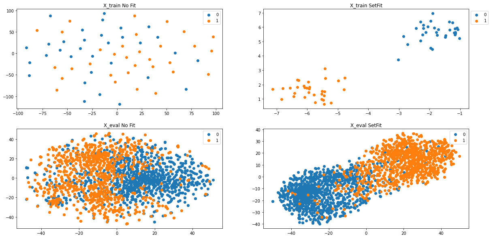

<a href="https://colab.research.google.com/github/Ankur3107/nlp_notebooks/blob/master/Few-shot/SetFit_SST_2_Few_shot.ipynb" target="_parent"></a>

Reference Links:

1. https://towardsdatascience.com/sentence-transformer-fine-tuning-setfit-outperforms-gpt-3-on-few-shot-text-classification-while-d9a3788f0b4e

2. https://arxiv.org/pdf/2109.14076.pdf

3. https://huggingface.co/spaces/ought/raft-leaderboard

4. https://github.com/timoschick/pet


# Init


```python
!pip install sentence_transformers -q
```

         |████████████████████████████████| 78 kB 3.4 MB/s 
         |████████████████████████████████| 3.4 MB 11.4 MB/s 
         |████████████████████████████████| 3.3 MB 36.4 MB/s 
         |████████████████████████████████| 1.2 MB 29.8 MB/s 
         |████████████████████████████████| 61 kB 370 kB/s 
         |████████████████████████████████| 596 kB 25.4 MB/s 
         |████████████████████████████████| 895 kB 32.0 MB/s 
    [?25h  Building wheel for sentence-transformers (setup.py) ... [?25l[?25hdone


```python
from sklearn.metrics import accuracy_score, f1_score
from sklearn.linear_model import LogisticRegression
from sentence_transformers import SentenceTransformer, InputExample, losses, models, datasets, evaluation
from torch.utils.data import DataLoader

from sklearn.manifold import TSNE
from matplotlib import pyplot as plt

# import warnings filter
from warnings import simplefilter
# ignore all future warnings
simplefilter(action='ignore', category=FutureWarning)

import pandas as pd
import numpy as np

import torch
import random
import torch

def set_seed(seed):
  random.seed(seed)
  np.random.seed(seed)
  torch.manual_seed(seed)
```


```python
def sentence_pairs_generation(sentences, labels, pairs):
	# initialize two empty lists to hold the (sentence, sentence) pairs and
	# labels to indicate if a pair is positive or negative

  numClassesList = np.unique(labels)
  idx = [np.where(labels == i)[0] for i in numClassesList]

  for idxA in range(len(sentences)):      
    currentSentence = sentences[idxA]
    label = labels[idxA]
    idxB = np.random.choice(idx[np.where(numClassesList==label)[0][0]])
    posSentence = sentences[idxB]
		  # prepare a positive pair and update the sentences and labels
		  # lists, respectively
    pairs.append(InputExample(texts=[currentSentence, posSentence], label=1.0))

    negIdx = np.where(labels != label)[0]
    negSentence = sentences[np.random.choice(negIdx)]
		  # prepare a negative pair of images and update our lists
    pairs.append(InputExample(texts=[currentSentence, negSentence], label=0.0))
  
	# return a 2-tuple of our image pairs and labels
  return (pairs)
```


```python
#SST-2
# Load SST-2 dataset into a pandas dataframe.

train_df = pd.read_csv('https://github.com/clairett/pytorch-sentiment-classification/raw/master/data/SST2/train.tsv', delimiter='\t', header=None)

# Load the test dataset into a pandas dataframe.
eval_df = pd.read_csv('https://github.com/clairett/pytorch-sentiment-classification/raw/master/data/SST2/test.tsv', delimiter='\t', header=None)

text_col=train_df.columns.values[0] 
category_col=train_df.columns.values[1]

x_eval = eval_df[text_col].values.tolist()
y_eval = eval_df[category_col].values.tolist()
```


```python
train_df.head()
```


  <div id="df-ad145a91-fe65-4f27-90e9-8193b3dfe59a">
    <div class="colab-df-container">
      <div>
<style scoped>
    .dataframe tbody tr th:only-of-type {
        vertical-align: middle;
    }

    .dataframe tbody tr th {
        vertical-align: top;
    }

    .dataframe thead th {
        text-align: right;
    }
</style>
<table border="1" class="dataframe">
  <thead>
    <tr style="text-align: right;">
      <th></th>
      <th>0</th>
      <th>1</th>
    </tr>
  </thead>
  <tbody>
    <tr>
      <th>0</th>
      <td>a stirring , funny and finally transporting re...</td>
      <td>1</td>
    </tr>
    <tr>
      <th>1</th>
      <td>apparently reassembled from the cutting room f...</td>
      <td>0</td>
    </tr>
    <tr>
      <th>2</th>
      <td>they presume their audience wo n't sit still f...</td>
      <td>0</td>
    </tr>
    <tr>
      <th>3</th>
      <td>this is a visually stunning rumination on love...</td>
      <td>1</td>
    </tr>
    <tr>
      <th>4</th>
      <td>jonathan parker 's bartleby should have been t...</td>
      <td>1</td>
    </tr>
  </tbody>
</table>
</div>
      <button class="colab-df-convert" onclick="convertToInteractive('df-ad145a91-fe65-4f27-90e9-8193b3dfe59a')"
              title="Convert this dataframe to an interactive table."
              style="display:none;">

  <svg xmlns="http://www.w3.org/2000/svg" height="24px"viewBox="0 0 24 24"
       width="24px">
    <path d="M0 0h24v24H0V0z" fill="none"/>
    <path d="M18.56 5.44l.94 2.06.94-2.06 2.06-.94-2.06-.94-.94-2.06-.94 2.06-2.06.94zm-11 1L8.5 8.5l.94-2.06 2.06-.94-2.06-.94L8.5 2.5l-.94 2.06-2.06.94zm10 10l.94 2.06.94-2.06 2.06-.94-2.06-.94-.94-2.06-.94 2.06-2.06.94z"/><path d="M17.41 7.96l-1.37-1.37c-.4-.4-.92-.59-1.43-.59-.52 0-1.04.2-1.43.59L10.3 9.45l-7.72 7.72c-.78.78-.78 2.05 0 2.83L4 21.41c.39.39.9.59 1.41.59.51 0 1.02-.2 1.41-.59l7.78-7.78 2.81-2.81c.8-.78.8-2.07 0-2.86zM5.41 20L4 18.59l7.72-7.72 1.47 1.35L5.41 20z"/>
  </svg>
      </button>

  <style>
    .colab-df-container {
      display:flex;
      flex-wrap:wrap;
      gap: 12px;
    }

    .colab-df-convert {
      background-color: #E8F0FE;
      border: none;
      border-radius: 50%;
      cursor: pointer;
      display: none;
      fill: #1967D2;
      height: 32px;
      padding: 0 0 0 0;
      width: 32px;
    }

    .colab-df-convert:hover {
      background-color: #E2EBFA;
      box-shadow: 0px 1px 2px rgba(60, 64, 67, 0.3), 0px 1px 3px 1px rgba(60, 64, 67, 0.15);
      fill: #174EA6;
    }

    [theme=dark] .colab-df-convert {
      background-color: #3B4455;
      fill: #D2E3FC;
    }

    [theme=dark] .colab-df-convert:hover {
      background-color: #434B5C;
      box-shadow: 0px 1px 3px 1px rgba(0, 0, 0, 0.15);
      filter: drop-shadow(0px 1px 2px rgba(0, 0, 0, 0.3));
      fill: #FFFFFF;
    }
  </style>

      <script>
        const buttonEl =
          document.querySelector('#df-ad145a91-fe65-4f27-90e9-8193b3dfe59a button.colab-df-convert');
        buttonEl.style.display =
          google.colab.kernel.accessAllowed ? 'block' : 'none';

        async function convertToInteractive(key) {
          const element = document.querySelector('#df-ad145a91-fe65-4f27-90e9-8193b3dfe59a');
          const dataTable =
            await google.colab.kernel.invokeFunction('convertToInteractive',
                                                     [key], {});
          if (!dataTable) return;

          const docLinkHtml = 'Like what you see? Visit the ' +
            '<a target="_blank" href=https://colab.research.google.com/notebooks/data_table.ipynb>data table notebook</a>'
            + ' to learn more about interactive tables.';
          element.innerHTML = '';
          dataTable['output_type'] = 'display_data';
          await google.colab.output.renderOutput(dataTable, element);
          const docLink = document.createElement('div');
          docLink.innerHTML = docLinkHtml;
          element.appendChild(docLink);
        }
      </script>
    </div>
  </div>


# SetFit


```python
#@title SetFit
st_model = 'paraphrase-mpnet-base-v2' #@param ['paraphrase-mpnet-base-v2', 'all-mpnet-base-v1', 'all-mpnet-base-v2', 'stsb-mpnet-base-v2', 'all-MiniLM-L12-v2', 'paraphrase-albert-small-v2', 'all-roberta-large-v1']
num_training = 32 #@param ["8", "16", "32", "54", "128", "256", "512"] {type:"raw"}
num_itr = 5 #@param ["1", "2", "3", "4", "5", "10"] {type:"raw"}
plot2d_checkbox = True #@param {type: 'boolean'}

```


```python
set_seed(0)
# Equal samples per class training
train_df_sample = pd.concat([train_df[train_df[1]==0].sample(num_training), train_df[train_df[1]==1].sample(num_training)])
x_train = train_df_sample[text_col].values.tolist()
y_train = train_df_sample[category_col].values.tolist()

```


```python
train_df_sample.shape
```


    (64, 2)


```python
x_train[0:5], y_train[0:5]
```


    (['makes a joke out of car chases for an hour and then gives us half an hour of car chases',
      "so mind numbingly awful that you hope britney wo n't do it one more time , as far as movies are concerned",
      "maid in manhattan proves that it 's easier to change the sheets than to change hackneyed concepts when it comes to dreaming up romantic comedies",
      'if you go , pack your knitting needles',
      'time of favor could have given audiences the time of day by concentrating on the elements of a revealing alienation among a culture of people who sadly are at hostile odds with one another through recklessness and retaliation'],
     [0, 0, 0, 0, 0])


```python
train_examples = [] 
for x in range(num_itr):
  train_examples = sentence_pairs_generation(np.array(x_train), np.array(y_train), train_examples)
```


```python
len(train_examples)
```


    640


```python
i_example = train_examples[0]
```


```python
i_example.texts, i_example.label
```


    (['makes a joke out of car chases for an hour and then gives us half an hour of car chases',
      'it is that rare combination of bad writing , bad direction and bad acting the trifecta of badness'],
     1.0)


```python
orig_model = SentenceTransformer(st_model)
model = SentenceTransformer(st_model)
```


    Downloading:   0%|          | 0.00/690 [00:00<?, ?B/s]


    Downloading:   0%|          | 0.00/3.70k [00:00<?, ?B/s]


    Downloading:   0%|          | 0.00/594 [00:00<?, ?B/s]


    Downloading:   0%|          | 0.00/122 [00:00<?, ?B/s]


    Downloading:   0%|          | 0.00/229 [00:00<?, ?B/s]


    Downloading:   0%|          | 0.00/438M [00:00<?, ?B/s]


    Downloading:   0%|          | 0.00/53.0 [00:00<?, ?B/s]


    Downloading:   0%|          | 0.00/239 [00:00<?, ?B/s]


    Downloading:   0%|          | 0.00/466k [00:00<?, ?B/s]


    Downloading:   0%|          | 0.00/1.19k [00:00<?, ?B/s]


    Downloading:   0%|          | 0.00/232k [00:00<?, ?B/s]


    Downloading:   0%|          | 0.00/190 [00:00<?, ?B/s]


```python
# S-BERT adaptation 
train_dataloader = DataLoader(train_examples, shuffle=True, batch_size=16)
train_loss = losses.CosineSimilarityLoss(model)
model.fit(train_objectives=[(train_dataloader, train_loss)], epochs=1, warmup_steps=10, show_progress_bar=True)

```


    Epoch:   0%|          | 0/1 [00:00<?, ?it/s]


    Iteration:   0%|          | 0/40 [00:00<?, ?it/s]


```python
len(y_train)
```


    64


```python
# No Fit
X_train_noFT = orig_model.encode(x_train)
X_eval_noFT = orig_model.encode(x_eval)

sgd =  LogisticRegression()
sgd.fit(X_train_noFT, y_train)
y_pred_eval_sgd = sgd.predict(X_eval_noFT)

print('Acc. No Fit', accuracy_score(y_eval, y_pred_eval_sgd))
```

    Acc. No Fit 0.8390993959362988


```python
# With Fit (SetFit)
X_train = model.encode(x_train)
X_eval = model.encode(x_eval)

sgd =  LogisticRegression()
sgd.fit(X_train, y_train)
y_pred_eval_sgd = sgd.predict(X_eval)

print('Acc. SetFit', accuracy_score(y_eval, y_pred_eval_sgd))
```

    Acc. SetFit 0.9082921471718836


```python
#Plot 2-D 2x2 figures
if plot2d_checkbox:   

  plt.figure(figsize=(20,10))

#Plot X_train_noFit
  X_embedded = TSNE(n_components=2).fit_transform(np.array(X_train_noFT))
  plt.subplot(221)
  plt.title('X_train No Fit')

  for i, t in enumerate(set(np.array(y_train))):
      idx = np.array(y_train) == t
      plt.scatter(X_embedded[idx, 0], X_embedded[idx, 1], label=t)   

  plt.legend(bbox_to_anchor=(1, 1));

#Plot X_eval noFit
  X_embedded = TSNE(n_components=2).fit_transform(np.array(X_eval_noFT))
  plt.subplot(223)
  plt.title('X_eval No Fit')

  for i, t in enumerate(set(np.array(y_eval))):
      idx = np.array(y_eval) == t
      plt.scatter(X_embedded[idx, 0], X_embedded[idx, 1], label=t)   

  plt.legend(bbox_to_anchor=(1, 1));


#Plot X_train SetFit
  X_embedded = TSNE(n_components=2).fit_transform(np.array(X_train))

  plt.subplot(222)
  plt.title('X_train SetFit')

  for i, t in enumerate(set(np.array(y_train))):
      idx = np.array(y_train) == t
      plt.scatter(X_embedded[idx, 0], X_embedded[idx, 1], label=t)   

  plt.legend(bbox_to_anchor=(1, 1));

#Plot X_eval SetFit
  X_embedded = TSNE(n_components=2).fit_transform(np.array(X_eval))
  plt.subplot(224)
  plt.title('X_eval SetFit')

  for i, t in enumerate(set(np.array(y_eval))):
      idx = np.array(y_eval) == t
      plt.scatter(X_embedded[idx, 0], X_embedded[idx, 1], label=t)   

  plt.legend(bbox_to_anchor=(1, 1));

```


    

    


```python

```
