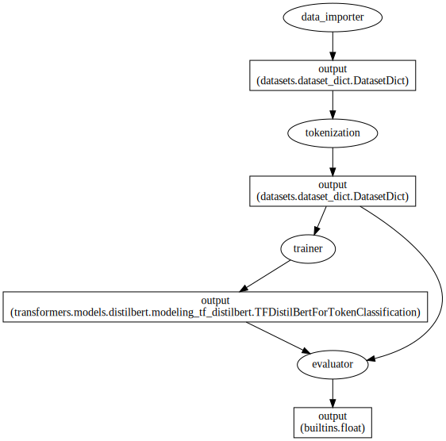

<a href="https://colab.research.google.com/github/Ankur3107/nlp_notebooks/blob/master/token-classification/token_classification_transformers_zenml.ipynb" target="_parent"></a>


```python
!pip install zenml -q
```

         |████████████████████████████████| 326 kB 29.2 MB/s 
         |████████████████████████████████| 10.1 MB 63.7 MB/s 
         |████████████████████████████████| 636 kB 63.8 MB/s 
         |████████████████████████████████| 217 kB 72.9 MB/s 
         |████████████████████████████████| 181 kB 70.0 MB/s 
         |████████████████████████████████| 10.9 MB 65.9 MB/s 
         |████████████████████████████████| 97 kB 7.3 MB/s 
         |████████████████████████████████| 1.2 MB 57.0 MB/s 
         |████████████████████████████████| 151 kB 71.6 MB/s 
         |████████████████████████████████| 46 kB 4.6 MB/s 
         |████████████████████████████████| 63 kB 2.2 MB/s 
         |████████████████████████████████| 2.3 MB 65.6 MB/s 
         |████████████████████████████████| 508 kB 69.1 MB/s 
         |████████████████████████████████| 255 kB 77.0 MB/s 
         |████████████████████████████████| 63 kB 2.2 MB/s 
         |████████████████████████████████| 40 kB 7.4 MB/s 
         |████████████████████████████████| 129 kB 63.6 MB/s 
         |████████████████████████████████| 135 kB 65.4 MB/s 
         |████████████████████████████████| 147 kB 79.2 MB/s 
         |████████████████████████████████| 6.5 MB 71.2 MB/s 
         |████████████████████████████████| 53 kB 2.5 MB/s 
         |████████████████████████████████| 49 kB 7.0 MB/s 
         |████████████████████████████████| 1.1 MB 63.2 MB/s 
         |████████████████████████████████| 51 kB 8.1 MB/s 
    [?25h  Building wheel for dill (setup.py) ... [?25l[?25hdone
    ERROR: pip's dependency resolver does not currently take into account all the packages that are installed. This behaviour is the source of the following dependency conflicts.
    tensorflow 2.8.0 requires tf-estimator-nightly==2.8.0.dev2021122109, which is not installed.
    multiprocess 0.70.12.2 requires dill>=0.3.4, but you have dill 0.3.1.1 which is incompatible.
    gym 0.17.3 requires cloudpickle<1.7.0,>=1.2.0, but you have cloudpickle 2.0.0 which is incompatible.
    google-colab 1.0.0 requires requests~=2.23.0, but you have requests 2.27.1 which is incompatible.
    flask 1.1.4 requires click<8.0,>=5.1, but you have click 8.0.4 which is incompatible.
    datascience 0.10.6 requires folium==0.2.1, but you have folium 0.8.3 which is incompatible.


```python
!pip install transformers datasets -q
```

         |████████████████████████████████| 3.5 MB 34.4 MB/s 
         |████████████████████████████████| 311 kB 71.4 MB/s 
         |████████████████████████████████| 67 kB 6.7 MB/s 
         |████████████████████████████████| 895 kB 70.9 MB/s 
         |████████████████████████████████| 6.8 MB 64.5 MB/s 
         |████████████████████████████████| 1.1 MB 51.1 MB/s 
         |████████████████████████████████| 133 kB 74.7 MB/s 
         |████████████████████████████████| 243 kB 72.3 MB/s 
         |████████████████████████████████| 144 kB 35.4 MB/s 
         |████████████████████████████████| 94 kB 2.1 MB/s 
         |████████████████████████████████| 271 kB 72.8 MB/s 
         |████████████████████████████████| 86 kB 7.5 MB/s 
    ERROR: pip's dependency resolver does not currently take into account all the packages that are installed. This behaviour is the source of the following dependency conflicts.
    apache-beam 2.36.0 requires dill<0.3.2,>=0.3.1.1, but you have dill 0.3.4 which is incompatible.
    [?25h


```python
!pip install mlflow
```


```python
!git init
!zenml init
```

    Initialized empty Git repository in /content/.git/
    Initializing ZenML repository at /content.
    INFO:numexpr.utils:NumExpr defaulting to 2 threads.
    Registered stack component with name 'local_orchestrator'.
    Registered stack component with name 'local_metadata_store'.
    Registered stack component with name 'local_artifact_store'.
    Registered stack with name 'local_stack'.
    ZenML repository initialized at /content.


```python
ls -la
```

    total 24
    drwxr-xr-x 1 root root 4096 Feb 20 09:54 ./
    drwxr-xr-x 1 root root 4096 Feb 20 09:50 ../
    drwxr-xr-x 4 root root 4096 Feb  1 14:31 .config/
    drwxr-xr-x 7 root root 4096 Feb 20 09:54 .git/
    drwxr-xr-x 1 root root 4096 Feb  1 14:32 sample_data/
    drwxr-xr-x 5 root root 4096 Feb 20 09:54 .zen/


```python
import mlflow
from zenml.integrations.mlflow.mlflow_step_decorator import enable_mlflow
```


```python
from zenml.pipelines import Schedule, pipeline
from zenml.steps import BaseStepConfig, Output, step
from datasets import load_dataset, load_metric
from datasets import Dataset
from datasets.dataset_dict import DatasetDict
import os
from typing import Any, Type
from zenml.artifacts import DataArtifact, SchemaArtifact, StatisticsArtifact, ModelArtifact
from zenml.materializers.base_materializer import BaseMaterializer
```


```python
from transformers import AutoTokenizer
from transformers import TFAutoModelForTokenClassification, TFDistilBertForTokenClassification
from transformers import create_optimizer
from transformers import DataCollatorForTokenClassification
```


```python
DEFAULT_FILENAME = "dataset.parquet.gzip"
COMPRESSION_TYPE = "gzip"
DEFAULT_DICT_FILENAME = "dict_datasets"

class DatasetMaterializer(BaseMaterializer):
    """Materializer to read data to and from pandas."""

    ASSOCIATED_TYPES = (Dataset, DatasetDict)
    ASSOCIATED_ARTIFACT_TYPES = (
        DataArtifact,
    )

    def handle_input(self, data_type: Type[Any]) -> Dataset:
        """Reads Dataset from a parquet file."""
        super().handle_input(data_type)
        if issubclass(data_type, Dataset):
          return Dataset.from_parquet(
              os.path.join(self.artifact.uri, DEFAULT_FILENAME))
        elif issubclass(data_type, DatasetDict):
          return DatasetDict.load_from_disk(
              os.path.join(self.artifact.uri, DEFAULT_DICT_FILENAME)
          )

    def handle_return(self, ds: Type[Any]) -> None:
        """Writes a Dataset to the specified filename.
        Args:
            Dataset: The Dataset to write.
        """
        super().handle_return(ds)
        if isinstance(ds, Dataset):
          filepath = os.path.join(self.artifact.uri, DEFAULT_FILENAME)
          ds.to_parquet(filepath, compression=COMPRESSION_TYPE)
        elif isinstance(ds, DatasetDict):
          filepath = os.path.join(self.artifact.uri, DEFAULT_DICT_FILENAME)
          ds.save_to_disk(filepath)
```


```python
DEFAULT_MODEL_DIR = "hf_model"

class HFModelMaterializer(BaseMaterializer):
    """Materializer to read data to and from pandas."""

    ASSOCIATED_TYPES = (TFDistilBertForTokenClassification, )
    ASSOCIATED_ARTIFACT_TYPES = (
        ModelArtifact,
    )

    def handle_input(self, data_type: Type[Any]) -> Dataset:
        """Reads Dataset from a parquet file."""
        super().handle_input(data_type)

        return TFAutoModelForTokenClassification.from_pretrained(
            os.path.join(self.artifact.uri, DEFAULT_MODEL_DIR)
        )

    def handle_return(self, model: Type[Any]) -> None:
        """Writes a Dataset to the specified filename.
        Args:
            Dataset: The Dataset to write.
        """
        super().handle_return(model)
        model.save_pretrained(os.path.join(self.artifact.uri, DEFAULT_MODEL_DIR))
```


```python
class TokenClassificationConfig(BaseStepConfig):
  task = "ner"  # Should be one of "ner", "pos" or "chunk"
  model_checkpoint = "distilbert-base-uncased"
  batch_size = 16
  dataset_name = "conll2003"
  label_all_tokens = True
  num_train_epochs = 3
```


```python
@step#(enable_cache=False)
def data_importer(
    config: TokenClassificationConfig,
) -> DatasetDict:
  datasets = load_dataset(config.dataset_name)
  print("Sample Example :", datasets["train"][0])
  #label_list = datasets["train"].features[f"{config.task}_tags"].feature.names
  return datasets
```


```python
@step#(enable_cache=False)
def tokenization(
    config: TokenClassificationConfig,
    datasets: DatasetDict,
) -> DatasetDict:

  def tokenize_and_align_labels(examples):
    tokenized_inputs = tokenizer(
        examples["tokens"], truncation=True, is_split_into_words=True
    )

    labels = []
    for i, label in enumerate(examples[f"{config.task}_tags"]):
        word_ids = tokenized_inputs.word_ids(batch_index=i)
        previous_word_idx = None
        label_ids = []
        for word_idx in word_ids:
            # Special tokens have a word id that is None. We set the label to -100 so they are automatically
            # ignored in the loss function.
            if word_idx is None:
                label_ids.append(-100)
            # We set the label for the first token of each word.
            elif word_idx != previous_word_idx:
                label_ids.append(label[word_idx])
            # For the other tokens in a word, we set the label to either the current label or -100, depending on
            # the label_all_tokens flag.
            else:
                label_ids.append(label[word_idx] if config.label_all_tokens else -100)
            previous_word_idx = word_idx

        labels.append(label_ids)

    tokenized_inputs["labels"] = labels
    return tokenized_inputs
  tokenizer = AutoTokenizer.from_pretrained(config.model_checkpoint)
  tokenized_datasets = datasets.map(tokenize_and_align_labels, batched=True)
  return tokenized_datasets
```


```python
@enable_mlflow
@step#(enable_cache=False)
def trainer(
    config: TokenClassificationConfig,
    tokenized_datasets: DatasetDict,
) -> TFDistilBertForTokenClassification:
  label_list = tokenized_datasets["train"].features[f"{config.task}_tags"].feature.names
  
  model = TFAutoModelForTokenClassification.from_pretrained(
    config.model_checkpoint, num_labels=len(label_list)
  )
  
  num_train_steps = (len(tokenized_datasets["train"]) // config.batch_size) * config.num_train_epochs
  optimizer, lr_schedule = create_optimizer(
      init_lr=2e-5,
      num_train_steps=num_train_steps,
      weight_decay_rate=0.01,
      num_warmup_steps=0,
  )

  model.compile(optimizer=optimizer)

  tokenizer = AutoTokenizer.from_pretrained(config.model_checkpoint)
  data_collator = DataCollatorForTokenClassification(tokenizer, return_tensors="tf")

  train_set = tokenized_datasets["train"].to_tf_dataset(
    columns=["attention_mask", "input_ids", "labels"],
    shuffle=True,
    batch_size=config.batch_size,
    collate_fn=data_collator,
  )
  validation_set = tokenized_datasets["validation"].to_tf_dataset(
      columns=["attention_mask", "input_ids", "labels"],
      shuffle=False,
      batch_size=config.batch_size,
      collate_fn=data_collator,
  )

  mlflow.tensorflow.autolog()
  model.fit(
    train_set,
    #validation_data=validation_set,
    epochs=config.num_train_epochs
  )
  return model
```


```python
import tensorflow as tf

@enable_mlflow
@step#(enable_cache=False)
def evaluator(
    config: TokenClassificationConfig,
    model: TFDistilBertForTokenClassification,
    tokenized_datasets: DatasetDict,
) -> float:
  tokenizer = AutoTokenizer.from_pretrained(config.model_checkpoint)
  data_collator = DataCollatorForTokenClassification(tokenizer, return_tensors="tf")
  model.compile(optimizer=tf.keras.optimizers.Adam())
  validation_set = tokenized_datasets["validation"].to_tf_dataset(
      columns=["attention_mask", "input_ids", "labels"],
      shuffle=False,
      batch_size=config.batch_size,
      collate_fn=data_collator,
  )
  test_loss = model.evaluate(validation_set, verbose=1)
  mlflow.log_metric("val_loss", test_loss)
  return test_loss
```


```python
@pipeline#(enable_cache=False)
def train_pipeline(importer, tokenizer, trainer):
  datasets = importer()
  tokenized_datasets = tokenizer(datasets=datasets)
  model = trainer(tokenized_datasets)
```


```python
#train_pipeline(importer=data_importer().with_return_materializers(DatasetMaterializer),
#                       tokenizer=tokenization().with_return_materializers(DatasetMaterializer),
#               trainer=trainer().with_return_materializers(HFModelMaterializer)).run()
```

    Creating run for pipeline: `train_pipeline`
    Cache enabled for pipeline `train_pipeline`
    Using stack `local_stack` to run pipeline `train_pipeline`...
    Step `data_importer` has started.
    Step `data_importer` has finished in 0.043s.
    Step `tokenization` has started.
    Step `tokenization` has finished in 0.035s.
    Step `trainer` has started.


    Some layers from the model checkpoint at distilbert-base-uncased were not used when initializing TFDistilBertForTokenClassification: ['vocab_layer_norm', 'activation_13', 'vocab_projector', 'vocab_transform']
    - This IS expected if you are initializing TFDistilBertForTokenClassification from the checkpoint of a model trained on another task or with another architecture (e.g. initializing a BertForSequenceClassification model from a BertForPreTraining model).
    - This IS NOT expected if you are initializing TFDistilBertForTokenClassification from the checkpoint of a model that you expect to be exactly identical (initializing a BertForSequenceClassification model from a BertForSequenceClassification model).
    Some layers of TFDistilBertForTokenClassification were not initialized from the model checkpoint at distilbert-base-uncased and are newly initialized: ['dropout_39', 'classifier']
    You should probably TRAIN this model on a down-stream task to be able to use it for predictions and inference.
    No loss specified in compile() - the model's internal loss computation will be used as the loss. Don't panic - this is a common way to train TensorFlow models in Transformers! Please ensure your labels are passed as keys in the input dict so that they are accessible to the model during the forward pass. To disable this behaviour, please pass a loss argument, or explicitly pass loss=None if you do not want your model to compute a loss.
    /usr/local/lib/python3.7/dist-packages/transformers/tokenization_utils_base.py:707: VisibleDeprecationWarning: Creating an ndarray from ragged nested sequences (which is a list-or-tuple of lists-or-tuples-or ndarrays with different lengths or shapes) is deprecated. If you meant to do this, you must specify 'dtype=object' when creating the ndarray.
      tensor = as_tensor(value)
    /usr/local/lib/python3.7/dist-packages/tensorflow/python/autograph/impl/api.py:371: UserWarning: Using `-1` to mask the loss for the token is deprecated. Please use `-100` instead.
      return py_builtins.overload_of(f)(*args)


    10/10 [==============================] - 34s 2s/step - loss: 1.6988
    Step `trainer` has finished in 56.223s.
    Pipeline run `train_pipeline-20_Feb_22-07_02_06_772016` has finished in 56.331s.


```python
@pipeline#(enable_cache=False)
def train_eval_pipeline(importer, tokenizer, trainer, evaluator):
  datasets = importer()
  tokenized_datasets = tokenizer(datasets=datasets)
  model = trainer(tokenized_datasets)
  evaluator(model=model, tokenized_datasets=tokenized_datasets)
```


```python
train_eval_pipeline(importer=data_importer().with_return_materializers(DatasetMaterializer),
                       tokenizer=tokenization().with_return_materializers(DatasetMaterializer),
               trainer=trainer().with_return_materializers(HFModelMaterializer),
               evaluator=evaluator()).run()
```

    Creating run for pipeline: `train_eval_pipeline`
    Cache enabled for pipeline `train_eval_pipeline`
    Using stack `local_stack` to run pipeline `train_eval_pipeline`...
    Step `data_importer` has started.


    Downloading:   0%|          | 0.00/2.58k [00:00<?, ?B/s]


    Downloading:   0%|          | 0.00/1.62k [00:00<?, ?B/s]


    Downloading and preparing dataset conll2003/conll2003 (download: 959.94 KiB, generated: 9.78 MiB, post-processed: Unknown size, total: 10.72 MiB) to /root/.cache/huggingface/datasets/conll2003/conll2003/1.0.0/63f4ebd1bcb7148b1644497336fd74643d4ce70123334431a3c053b7ee4e96ee...


    Downloading:   0%|          | 0.00/983k [00:00<?, ?B/s]


    0 examples [00:00, ? examples/s]


    INFO:datasets_modules.datasets.conll2003.63f4ebd1bcb7148b1644497336fd74643d4ce70123334431a3c053b7ee4e96ee.conll2003:⏳ Generating examples from = /root/.cache/huggingface/datasets/downloads/extracted/fb350f14aaa0ce8a148eb2de9b8f4c19422485ca2524f6b4170579a4759a2d51/train.txt


    0 examples [00:00, ? examples/s]


    INFO:datasets_modules.datasets.conll2003.63f4ebd1bcb7148b1644497336fd74643d4ce70123334431a3c053b7ee4e96ee.conll2003:⏳ Generating examples from = /root/.cache/huggingface/datasets/downloads/extracted/fb350f14aaa0ce8a148eb2de9b8f4c19422485ca2524f6b4170579a4759a2d51/valid.txt


    0 examples [00:00, ? examples/s]


    INFO:datasets_modules.datasets.conll2003.63f4ebd1bcb7148b1644497336fd74643d4ce70123334431a3c053b7ee4e96ee.conll2003:⏳ Generating examples from = /root/.cache/huggingface/datasets/downloads/extracted/fb350f14aaa0ce8a148eb2de9b8f4c19422485ca2524f6b4170579a4759a2d51/test.txt


    Dataset conll2003 downloaded and prepared to /root/.cache/huggingface/datasets/conll2003/conll2003/1.0.0/63f4ebd1bcb7148b1644497336fd74643d4ce70123334431a3c053b7ee4e96ee. Subsequent calls will reuse this data.


      0%|          | 0/3 [00:00<?, ?it/s]


    Sample Example : {'id': '0', 'tokens': ['EU', 'rejects', 'German', 'call', 'to', 'boycott', 'British', 'lamb', '.'], 'pos_tags': [22, 42, 16, 21, 35, 37, 16, 21, 7], 'chunk_tags': [11, 21, 11, 12, 21, 22, 11, 12, 0], 'ner_tags': [3, 0, 7, 0, 0, 0, 7, 0, 0]}
    Step `data_importer` has finished in 7.227s.
    Step `tokenization` has started.


    Downloading:   0%|          | 0.00/28.0 [00:00<?, ?B/s]


    Downloading:   0%|          | 0.00/483 [00:00<?, ?B/s]


    Downloading:   0%|          | 0.00/226k [00:00<?, ?B/s]


    Downloading:   0%|          | 0.00/455k [00:00<?, ?B/s]


    WARNING:datasets.fingerprint:Parameter 'function'=<function tokenization.<locals>.tokenize_and_align_labels at 0x7f4983858ef0> of the transform datasets.arrow_dataset.Dataset._map_single couldn't be hashed properly, a random hash was used instead. Make sure your transforms and parameters are serializable with pickle or dill for the dataset fingerprinting and caching to work. If you reuse this transform, the caching mechanism will consider it to be different from the previous calls and recompute everything. This warning is only showed once. Subsequent hashing failures won't be showed.


      0%|          | 0/15 [00:00<?, ?ba/s]


      0%|          | 0/4 [00:00<?, ?ba/s]


      0%|          | 0/4 [00:00<?, ?ba/s]


    Step `tokenization` has finished in 4.195s.
    Step `trainer` has started.


    2022/02/20 09:58:49 INFO mlflow.tracking.fluent: Experiment with name 'train_eval_pipeline' does not exist. Creating a new experiment.


    Downloading:   0%|          | 0.00/347M [00:00<?, ?B/s]


    Some layers from the model checkpoint at distilbert-base-uncased were not used when initializing TFDistilBertForTokenClassification: ['vocab_projector', 'vocab_layer_norm', 'vocab_transform', 'activation_13']
    - This IS expected if you are initializing TFDistilBertForTokenClassification from the checkpoint of a model trained on another task or with another architecture (e.g. initializing a BertForSequenceClassification model from a BertForPreTraining model).
    - This IS NOT expected if you are initializing TFDistilBertForTokenClassification from the checkpoint of a model that you expect to be exactly identical (initializing a BertForSequenceClassification model from a BertForSequenceClassification model).
    Some layers of TFDistilBertForTokenClassification were not initialized from the model checkpoint at distilbert-base-uncased and are newly initialized: ['classifier', 'dropout_19']
    You should probably TRAIN this model on a down-stream task to be able to use it for predictions and inference.
    No loss specified in compile() - the model's internal loss computation will be used as the loss. Don't panic - this is a common way to train TensorFlow models in Transformers! Please ensure your labels are passed as keys in the input dict so that they are accessible to the model during the forward pass. To disable this behaviour, please pass a loss argument, or explicitly pass loss=None if you do not want your model to compute a loss.
    /usr/local/lib/python3.7/dist-packages/transformers/tokenization_utils_base.py:707: VisibleDeprecationWarning: Creating an ndarray from ragged nested sequences (which is a list-or-tuple of lists-or-tuples-or ndarrays with different lengths or shapes) is deprecated. If you meant to do this, you must specify 'dtype=object' when creating the ndarray.
      tensor = as_tensor(value)
    2022/02/20 09:59:02 WARNING mlflow.utils.autologging_utils: You are using an unsupported version of tensorflow. If you encounter errors during autologging, try upgrading / downgrading tensorflow to a supported version, or try upgrading MLflow.


    Epoch 1/3


    /usr/local/lib/python3.7/dist-packages/tensorflow/python/autograph/impl/api.py:371: UserWarning: Using `-1` to mask the loss for the token is deprecated. Please use `-100` instead.
      return py_builtins.overload_of(f)(*args)


      6/877 [..............................] - ETA: 1:45 - loss: 1.7235

    WARNING:tensorflow:Callback method `on_train_batch_end` is slow compared to the batch time (batch time: 0.0655s vs `on_train_batch_end` time: 0.0753s). Check your callbacks.


    877/877 [==============================] - 102s 102ms/step - loss: 0.1888
    Epoch 2/3
    877/877 [==============================] - 92s 104ms/step - loss: 0.0539
    Epoch 3/3
    877/877 [==============================] - 92s 105ms/step - loss: 0.0345


    WARNING:tensorflow:Skipping full serialization of Keras layer <keras.layers.core.dropout.Dropout object at 0x7f48776754d0>, because it is not built.
    WARNING:tensorflow:Skipping full serialization of Keras layer <keras.layers.core.dropout.Dropout object at 0x7f48775d32d0>, because it is not built.
    WARNING:tensorflow:Skipping full serialization of Keras layer <keras.layers.core.dropout.Dropout object at 0x7f48775d9dd0>, because it is not built.
    WARNING:tensorflow:Skipping full serialization of Keras layer <keras.layers.core.dropout.Dropout object at 0x7f48775c9b50>, because it is not built.
    WARNING:tensorflow:Skipping full serialization of Keras layer <keras.layers.core.dropout.Dropout object at 0x7f487768da50>, because it is not built.
    WARNING:tensorflow:Skipping full serialization of Keras layer <keras.layers.core.dropout.Dropout object at 0x7f48776ae950>, because it is not built.
    2022/02/20 10:05:39 WARNING mlflow.utils.autologging_utils: Encountered unexpected error during autologging: Unable to save the object {'loss': <function dummy_loss at 0x7f487b607b90>, 'logits': None} (a dictionary wrapper constructed automatically on attribute assignment). The wrapped dictionary was modified outside the wrapper (its final value was {'loss': <function dummy_loss at 0x7f487b607b90>, 'logits': None}, its value when a checkpoint dependency was added was None), which breaks restoration on object creation.
    
    If you don't need this dictionary checkpointed, wrap it in a non-trackable object; it will be subsequently ignored.


    Step `trainer` has finished in 7m31s.
    Step `evaluator` has started.


    Some layers from the model checkpoint at /root/.config/zenml/local_stores/4f1f1248-e71b-4ac6-ac34-396be78aa2b2/trainer/output/3/hf_model were not used when initializing TFDistilBertForTokenClassification: ['dropout_19']
    - This IS expected if you are initializing TFDistilBertForTokenClassification from the checkpoint of a model trained on another task or with another architecture (e.g. initializing a BertForSequenceClassification model from a BertForPreTraining model).
    - This IS NOT expected if you are initializing TFDistilBertForTokenClassification from the checkpoint of a model that you expect to be exactly identical (initializing a BertForSequenceClassification model from a BertForSequenceClassification model).
    Some layers of TFDistilBertForTokenClassification were not initialized from the model checkpoint at /root/.config/zenml/local_stores/4f1f1248-e71b-4ac6-ac34-396be78aa2b2/trainer/output/3/hf_model and are newly initialized: ['dropout_39']
    You should probably TRAIN this model on a down-stream task to be able to use it for predictions and inference.
    No loss specified in compile() - the model's internal loss computation will be used as the loss. Don't panic - this is a common way to train TensorFlow models in Transformers! Please ensure your labels are passed as keys in the input dict so that they are accessible to the model during the forward pass. To disable this behaviour, please pass a loss argument, or explicitly pass loss=None if you do not want your model to compute a loss.
    /usr/local/lib/python3.7/dist-packages/transformers/tokenization_utils_base.py:707: VisibleDeprecationWarning: Creating an ndarray from ragged nested sequences (which is a list-or-tuple of lists-or-tuples-or ndarrays with different lengths or shapes) is deprecated. If you meant to do this, you must specify 'dtype=object' when creating the ndarray.
      tensor = as_tensor(value)
    /usr/local/lib/python3.7/dist-packages/tensorflow/python/autograph/impl/api.py:371: UserWarning: Using `-1` to mask the loss for the token is deprecated. Please use `-100` instead.
      return py_builtins.overload_of(f)(*args)


    204/204 [==============================] - 9s 33ms/step - loss: 0.0587
    Step `evaluator` has finished in 10.280s.
    Pipeline run `train_eval_pipeline-20_Feb_22-09_58_38_115601` has finished in 7m53s.


```python
#train_pipeline(importer=data_importer().with_return_materializers(DatasetMaterializer),
#                       tokenizer=tokenization().with_return_materializers(DatasetMaterializer),
#               trainer=trainer()).run()
```

    Creating run for pipeline: `train_pipeline`
    Cache enabled for pipeline `train_pipeline`
    Using stack `local_stack` to run pipeline `train_pipeline`...
    Step `data_importer` has started.
    Step `data_importer` has finished in 0.041s.
    Step `tokenization` has started.
    Step `tokenization` has finished in 0.041s.
    Step `trainer` has started.


    Some layers from the model checkpoint at distilbert-base-uncased were not used when initializing TFDistilBertForTokenClassification: ['vocab_layer_norm', 'vocab_projector', 'vocab_transform', 'activation_13']
    - This IS expected if you are initializing TFDistilBertForTokenClassification from the checkpoint of a model trained on another task or with another architecture (e.g. initializing a BertForSequenceClassification model from a BertForPreTraining model).
    - This IS NOT expected if you are initializing TFDistilBertForTokenClassification from the checkpoint of a model that you expect to be exactly identical (initializing a BertForSequenceClassification model from a BertForSequenceClassification model).
    Some layers of TFDistilBertForTokenClassification were not initialized from the model checkpoint at distilbert-base-uncased and are newly initialized: ['dropout_59', 'classifier']
    You should probably TRAIN this model on a down-stream task to be able to use it for predictions and inference.
    No loss specified in compile() - the model's internal loss computation will be used as the loss. Don't panic - this is a common way to train TensorFlow models in Transformers! Please ensure your labels are passed as keys in the input dict so that they are accessible to the model during the forward pass. To disable this behaviour, please pass a loss argument, or explicitly pass loss=None if you do not want your model to compute a loss.
    /usr/local/lib/python3.7/dist-packages/transformers/tokenization_utils_base.py:707: VisibleDeprecationWarning: Creating an ndarray from ragged nested sequences (which is a list-or-tuple of lists-or-tuples-or ndarrays with different lengths or shapes) is deprecated. If you meant to do this, you must specify 'dtype=object' when creating the ndarray.
      tensor = as_tensor(value)
    /usr/local/lib/python3.7/dist-packages/tensorflow/python/autograph/impl/api.py:371: UserWarning: Using `-1` to mask the loss for the token is deprecated. Please use `-100` instead.
      return py_builtins.overload_of(f)(*args)


    10/10 [==============================] - 31s 2s/step - loss: 1.7103
    Step `trainer` has finished in 53.341s.
    Pipeline run `train_pipeline-20_Feb_22-06_23_52_536912` has finished in 53.457s.


# Install localtunnel


```python
!npm install -g localtunnel
```

# lineage


```python
!zenml integration install dash -f
```


```python
%%writefile run_lineage.py

from zenml.integrations.dash.visualizers.pipeline_run_lineage_visualizer import (
    PipelineRunLineageVisualizer,
)
from zenml.repository import Repository

repo = Repository()
latest_run = repo.get_pipelines()[-1].runs[-1]
print(latest_run)
PipelineRunLineageVisualizer().visualize(latest_run)
```

    Writing run_lineage.py


```python
!python run_lineage.py & lt --port 8050
```

    your url is: https://wonderful-seahorse-55.loca.lt
    INFO:numexpr.utils:NumExpr defaulting to 2 threads.
    PipelineRunView(id=2, name='train_eval_pipeline-20_Feb_22-09_58_38_115601')
    Dash is running on http://127.0.0.1:8050/
    
    Dash is running on http://127.0.0.1:8050/
    
     * Serving Flask app "zenml.integrations.dash.visualizers.pipeline_run_lineage_visualizer" (lazy loading)
     * Environment: production
       WARNING: This is a development server. Do not use it in a production deployment.
       Use a production WSGI server instead.
     * Debug mode: off
    INFO:werkzeug: * Running on http://127.0.0.1:8050/ (Press CTRL+C to quit)
    INFO:werkzeug:127.0.0.1 - - [20/Feb/2022 10:19:44] "GET /favicon.ico HTTP/1.1" 200 -
    INFO:werkzeug:127.0.0.1 - - [20/Feb/2022 10:19:44] "GET / HTTP/1.1" 200 -
    INFO:werkzeug:127.0.0.1 - - [20/Feb/2022 10:19:44] "GET /_dash-component-suites/dash/deps/polyfill@7.v2_2_0m1645352095.12.1.min.js HTTP/1.1" 200 -
    INFO:werkzeug:127.0.0.1 - - [20/Feb/2022 10:19:44] "GET /_dash-component-suites/dash/deps/react@16.v2_2_0m1645352095.14.0.min.js HTTP/1.1" 200 -
    INFO:werkzeug:127.0.0.1 - - [20/Feb/2022 10:19:44] "GET /_dash-component-suites/dash/deps/prop-types@15.v2_2_0m1645352095.7.2.min.js HTTP/1.1" 200 -
    INFO:werkzeug:127.0.0.1 - - [20/Feb/2022 10:19:44] "GET /_dash-component-suites/dash/deps/react-dom@16.v2_2_0m1645352095.14.0.min.js HTTP/1.1" 200 -
    INFO:werkzeug:127.0.0.1 - - [20/Feb/2022 10:19:44] "GET /_dash-component-suites/dash_cytoscape/dash_cytoscape.v0_2_0m1645352099.min.js HTTP/1.1" 200 -
    INFO:werkzeug:127.0.0.1 - - [20/Feb/2022 10:19:44] "GET /_dash-component-suites/dash_bootstrap_components/_components/dash_bootstrap_components.v1_0_3m1645352102.min.js HTTP/1.1" 200 -
    INFO:werkzeug:127.0.0.1 - - [20/Feb/2022 10:19:44] "GET /_dash-component-suites/dash/dash-renderer/build/dash_renderer.v2_2_0m1645352095.min.js HTTP/1.1" 200 -
    INFO:werkzeug:127.0.0.1 - - [20/Feb/2022 10:19:44] "GET /_dash-component-suites/dash/dcc/dash_core_components-shared.v2_2_0m1645352095.js HTTP/1.1" 200 -
    INFO:werkzeug:127.0.0.1 - - [20/Feb/2022 10:19:44] "GET /_dash-component-suites/dash/dcc/dash_core_components.v2_2_0m1645352095.js HTTP/1.1" 200 -
    INFO:werkzeug:127.0.0.1 - - [20/Feb/2022 10:19:44] "GET /_dash-component-suites/dash/html/dash_html_components.v2_0_2m1645352095.min.js HTTP/1.1" 200 -
    INFO:werkzeug:127.0.0.1 - - [20/Feb/2022 10:19:44] "GET /_dash-component-suites/dash/dash_table/bundle.v5_1_1m1645352095.js HTTP/1.1" 200 -
    INFO:werkzeug:127.0.0.1 - - [20/Feb/2022 10:20:02] "GET /_dash-layout HTTP/1.1" 200 -
    INFO:werkzeug:127.0.0.1 - - [20/Feb/2022 10:20:02] "GET /_dash-dependencies HTTP/1.1" 200 -
    INFO:werkzeug:127.0.0.1 - - [20/Feb/2022 10:20:03] "GET /_dash-component-suites/dash/dcc/async-markdown.js HTTP/1.1" 200 -
    INFO:werkzeug:127.0.0.1 - - [20/Feb/2022 10:20:03] "POST /_dash-update-component HTTP/1.1" 200 -
    INFO:werkzeug:127.0.0.1 - - [20/Feb/2022 10:20:03] "POST /_dash-update-component HTTP/1.1" 200 -
    INFO:werkzeug:127.0.0.1 - - [20/Feb/2022 10:20:06] "GET /_dash-component-suites/dash/dcc/async-highlight.js HTTP/1.1" 200 -


    ---------------------------------------------------------------------------

    KeyboardInterrupt                         Traceback (most recent call last)

    <ipython-input-35-cbe64bbddfbb> in <module>()
    ----> 1 get_ipython().system('python run_lineage.py & lt --port 8050')
    

    /usr/local/lib/python3.7/dist-packages/google/colab/_shell.py in system(self, *args, **kwargs)
        100       kwargs.update({'also_return_output': True})
        101 
    --> 102     output = _system_commands._system_compat(self, *args, **kwargs)  # pylint:disable=protected-access
        103 
        104     if pip_warn:


    /usr/local/lib/python3.7/dist-packages/google/colab/_system_commands.py in _system_compat(shell, cmd, also_return_output)
        445   # stack.
        446   result = _run_command(
    --> 447       shell.var_expand(cmd, depth=2), clear_streamed_output=False)
        448   shell.user_ns['_exit_code'] = result.returncode
        449   if -result.returncode in _INTERRUPTED_SIGNALS:


    /usr/local/lib/python3.7/dist-packages/google/colab/_system_commands.py in _run_command(cmd, clear_streamed_output)
        197       os.close(child_pty)
        198 
    --> 199       return _monitor_process(parent_pty, epoll, p, cmd, update_stdin_widget)
        200   finally:
        201     epoll.close()


    /usr/local/lib/python3.7/dist-packages/google/colab/_system_commands.py in _monitor_process(parent_pty, epoll, p, cmd, update_stdin_widget)
        227   while True:
        228     try:
    --> 229       result = _poll_process(parent_pty, epoll, p, cmd, decoder, state)
        230       if result is not None:
        231         return result


    /usr/local/lib/python3.7/dist-packages/google/colab/_system_commands.py in _poll_process(parent_pty, epoll, p, cmd, decoder, state)
        274   output_available = False
        275 
    --> 276   events = epoll.poll()
        277   input_events = []
        278   for _, event in events:


    KeyboardInterrupt: 


# MlFlow Tracking


```python
from zenml.environment import Environment
from zenml.integrations.mlflow.mlflow_environment import MLFLOW_ENVIRONMENT_NAME
```


```python
mlflow_env = Environment()[MLFLOW_ENVIRONMENT_NAME]
mlflow_env
```


    <zenml.integrations.mlflow.mlflow_environment.MLFlowEnvironment at 0x7f487ad5fe10>


```python
mlflow_env.tracking_uri
```


    'file:/root/.config/zenml/local_stores/4f1f1248-e71b-4ac6-ac34-396be78aa2b2/mlruns'


```python
!mlflow ui --backend-store-uri {mlflow_env.tracking_uri} & lt --port 5000
```

    your url is: https://honest-wasp-2.loca.lt
    [2022-02-20 10:23:21 +0000] [840] [INFO] Starting gunicorn 20.1.0
    [2022-02-20 10:23:21 +0000] [840] [INFO] Listening at: http://127.0.0.1:5000 (840)
    [2022-02-20 10:23:21 +0000] [840] [INFO] Using worker: sync
    [2022-02-20 10:23:21 +0000] [843] [INFO] Booting worker with pid: 843
    [2022-02-20 10:23:52 +0000] [840] [CRITICAL] WORKER TIMEOUT (pid:843)
    [2022-02-20 10:23:52 +0000] [843] [INFO] Worker exiting (pid: 843)
    [2022-02-20 10:23:52 +0000] [850] [INFO] Booting worker with pid: 850
    [2022-02-20 10:25:06 +0000] [840] [INFO] Handling signal: int
    [2022-02-20 10:25:06 +0000] [850] [INFO] Worker exiting (pid: 850)
    [2022-02-20 10:25:06 +0000] [840] [INFO] Shutting down: Master
    ^C


# Dag Visualization


```python
!zenml integration install graphviz -f
```

    Collecting graphviz>=0.17
      Downloading graphviz-0.19.1-py3-none-any.whl (46 kB)
         |████████████████████████████████| 46 kB 4.3 MB/s 
    [?25hInstalling collected packages: graphviz
      Attempting uninstall: graphviz
        Found existing installation: graphviz 0.10.1
        Uninstalling graphviz-0.10.1:
          Successfully uninstalled graphviz-0.10.1
    Successfully installed graphviz-0.19.1


```python
from zenml.repository import Repository
from zenml.integrations.graphviz.visualizers.pipeline_run_dag_visualizer import (
    PipelineRunDagVisualizer,
)
```


```python
repo = Repository()
pipe = repo.get_pipelines()[-1]
latest_run = pipe.runs[-1]
latest_run
```


    PipelineRunView(id=2, name='train_eval_pipeline-20_Feb_22-09_58_38_115601')


```python
PipelineRunDagVisualizer().visualize(latest_run)
```

    This integration is not completed yet. Results might be unexpected.


    

    


```python

```
